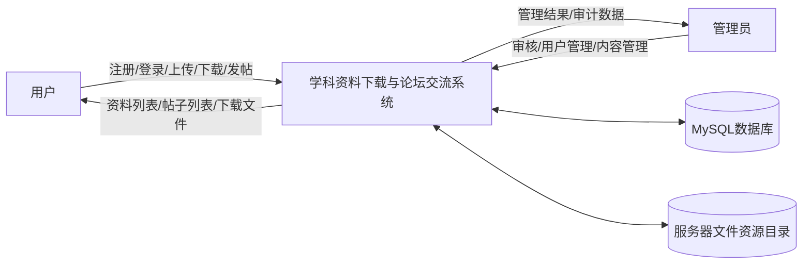
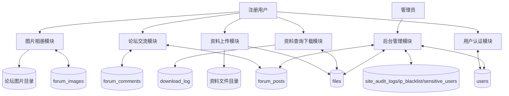
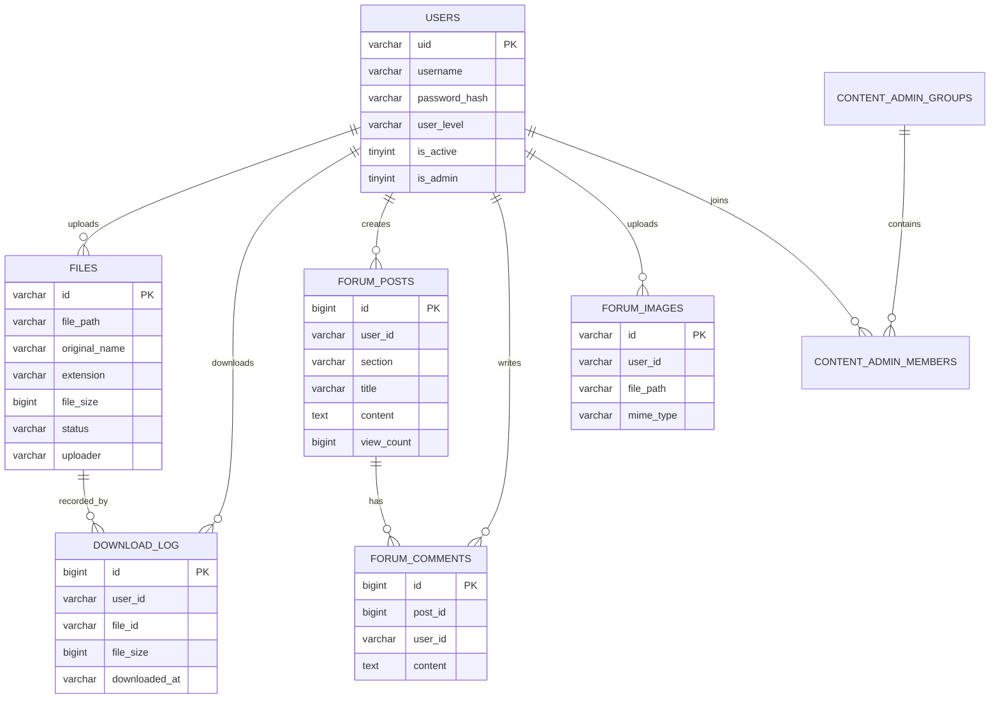
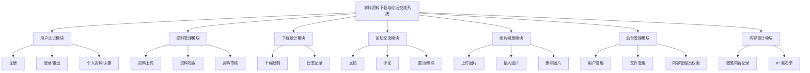
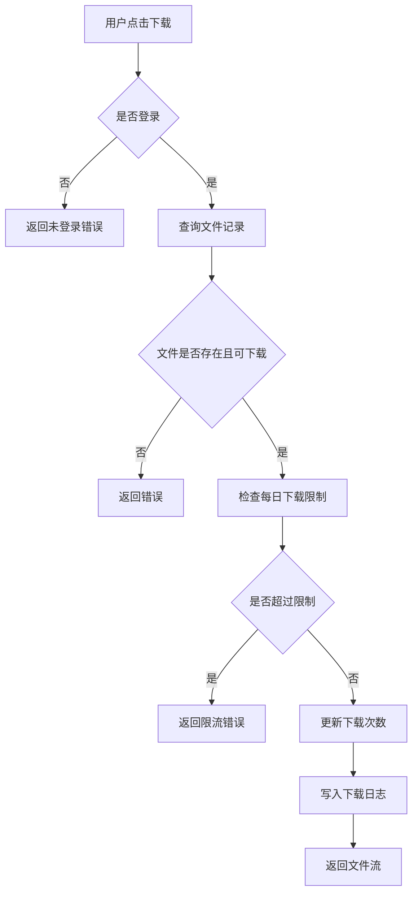
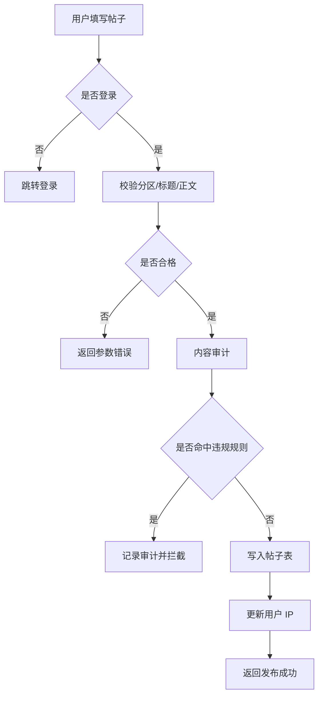
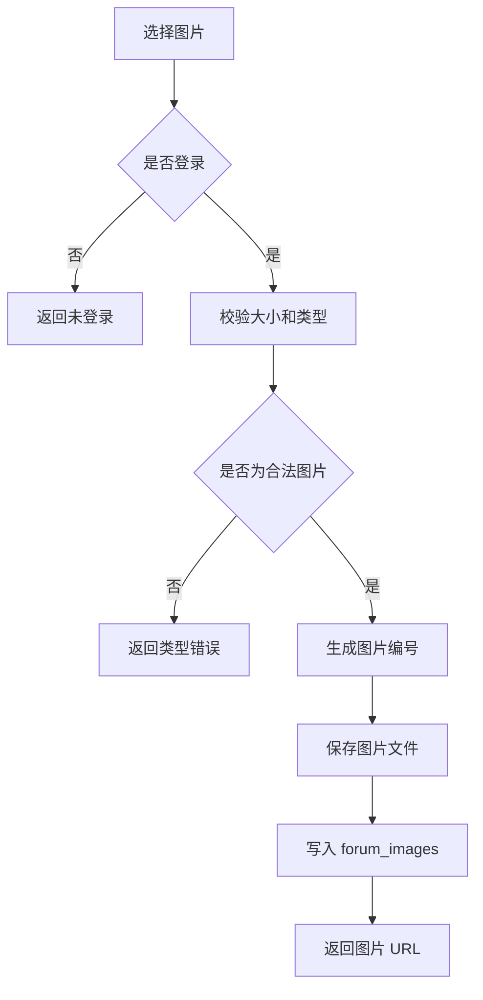

# 《数据库课程设计》课程设计报告

## 封面信息

课程名称：数据库课程设计  
设计题目：学科资料下载与论坛交流系统数据库设计与实现  
学生姓名：__________  
学号：__________  
班级：__________  
指导教师：__________  
完成日期：__________

## 摘要

本课程设计围绕“学科资料下载与论坛交流系统”展开，系统面向校园网用户提供资料检索、资料上传、管理员审核、文件下载、下载日志统计、用户管理、论坛发帖评论、帖子图片上传与相册管理、内容审计等功能。系统采用 B/S 架构，前端使用 Vue 3 和 Vite，后端使用 Java 17、Spring Boot 3 和 JdbcTemplate，数据库采用 MySQL 8，文件实体存放在服务器资源目录中，数据库负责保存用户、文件元数据、论坛内容、下载日志、审核与审计数据。

报告按照数据库设计流程，从需求分析、数据字典、数据流图、概念结构设计、逻辑结构设计、物理结构设计、数据库实施、程序实现与测试、视图/触发器/存储过程设计以及课程设计心得等方面进行说明。通过本次设计，完成了一个较完整的资料共享与论坛交流平台数据库方案，并实现了与应用程序相配合的数据库访问逻辑。

关键词：数据库课程设计；MySQL；Spring Boot；Vue；资料下载；论坛系统；B/S 架构

## 一、系统概述

### 1.1 设计背景

高校课程资料通常分散在不同同学、课程群、网盘或本地服务器中，查找和复用效率较低。传统文件共享方式缺少统一分类、审核机制、下载统计和用户贡献记录，也不便于围绕资料展开讨论。为解决这些问题，本系统设计一个面向校园用户的资料下载站，并配套论坛交流功能，使用户能够上传资料、检索资料、下载资料、发表学习讨论帖，并由管理员对资料和用户行为进行管理。

### 1.2 系统目标

系统的主要目标如下：

1. 建立统一的资料元数据管理数据库，支持按学科、目录、扩展名、关键词检索资料。
2. 支持登录用户上传资料，管理员审核后对普通用户公开。
3. 记录用户下载行为，为下载次数统计、下载限制和用户等级判断提供依据。
4. 建立论坛模块，支持分区发帖、回帖、帖子置顶、删除管理。
5. 支持帖子插入图片，并通过图片相册进行上传、插入和删除管理。
6. 支持管理员进行用户管理、内容审计、敏感内容记录和 IP 黑名单维护。
7. 系统采用 B/S 结构，便于部署在校园服务器和公网入口环境中。

### 1.3 开发与运行环境

| 类别 | 内容 |
|---|---|
| 后端语言 | Java 17 |
| 后端框架 | Spring Boot 3 |
| 数据访问 | Spring JdbcTemplate |
| 数据库 | MySQL 8 |
| 前端框架 | Vue 3、Vite |
| 部署方式 | Docker Compose、Nginx、frp |
| 系统架构 | B/S 架构 |
| 文件存储 | 服务器资源目录，数据库保存文件元数据 |

## 二、需求分析

### 2.1 用户角色分析

系统包含以下几类用户：

| 用户角色 | 主要职责 |
|---|---|
| 游客 | 浏览公开页面，查看登录入口，不能上传、下载或发帖 |
| 注册用户 | 登录、查看资料、上传资料、下载资料、发帖、评论、上传帖子图片 |
| 管理员 | 审核资料、删除资料、管理用户、封禁用户、查看审计记录、删除违规帖子和评论 |
| 内容管理员 | 根据授权范围查看和管理部分内容、用户和站点通知 |

### 2.2 功能需求

#### 2.2.1 用户认证与个人信息

用户可以注册账号并登录系统。系统使用用户编号作为用户主键，保存用户名、密码哈希、头像路径、用户等级、是否管理员、是否启用等信息。用户登录后，系统通过认证信息识别当前用户，并根据用户身份判断是否拥有上传、审核、删除、管理等权限。

#### 2.2.2 资料管理

资料管理是系统核心功能之一。用户可以上传 PDF、Word、PPT、Excel、压缩包、文本等类型的学习资料。资料上传后初始状态为 pending，管理员审核通过后状态变为 approved，只有审核通过的资料才能在公开资料列表中显示。系统需要保存资料路径、原始文件名、扩展名、文件大小、描述、学科分类、子目录、上传时间、下载次数、审核状态、上传者等信息。

#### 2.2.3 资料检索与下载

普通用户可以根据关键词、学科分类、子目录、扩展名查询资料。下载时系统检查用户登录状态、资料审核状态和下载限制。下载成功后，系统更新资料下载次数，并在下载日志表中记录用户、文件、文件大小、下载时间、来源节点等信息。

#### 2.2.4 论坛交流

论坛模块支持用户按分区发布帖子，帖子包含标题、正文、浏览次数、是否置顶、发帖 IP、发布时间等信息。用户可以在帖子下发表评论。管理员可以删除不合适的帖子和评论，指定管理员可以进行帖子置顶操作。

#### 2.2.5 帖子图片与相册管理

为满足帖子插入图片需求，系统提供论坛图片接口。用户可以上传 JPG、PNG、GIF、WebP 图片，系统将图片保存到服务器资源目录下的 forum-images 子目录，并在数据库中记录图片元数据。前端使用成熟编辑器组件支持图片插入，并提供相册面板，用户可以查看自己的图片、插入图片到正文、删除自己的图片。帖子详情页使用图片浏览组件实现点击放大浏览。

#### 2.2.6 管理与审计

管理员可以审核资料、删除资料、查看用户列表、封禁或解封用户、调整用户等级、查看论坛内容审计记录、敏感用户记录和 IP 黑名单。系统在用户发帖、评论等操作时进行内容检查，并对风险事件进行记录。

### 2.3 非功能需求

| 需求类型 | 要求 |
|---|---|
| 安全性 | 密码使用哈希保存；接口根据登录状态和管理员权限控制访问 |
| 可靠性 | 文件元数据和下载日志持久化保存；数据库建表脚本可重复执行 |
| 可维护性 | 前后端分离，后端按 Controller、Service、Support 分层 |
| 可扩展性 | 文件分类、论坛分区、用户等级、内容管理员权限均可继续扩展 |
| 易用性 | 前端提供资料搜索、分页、上传表单、论坛编辑器和相册管理 |
| 性能 | 常用查询字段建立索引，如资料状态、分类、创建时间、下载日志用户和日期 |

### 2.4 数据流图

#### 2.4.1 顶层数据流图



#### 2.4.2 一层数据流图



### 2.5 数据字典

#### 2.5.1 数据项

| 数据项 | 含义 | 类型/长度 | 约束 |
|---|---|---|---|
| uid | 用户编号 | VARCHAR(6) | 主键 |
| username | 用户名 | VARCHAR(64) | 唯一、非空 |
| password_hash | 密码哈希 | VARCHAR(255) | 非空 |
| file_id | 文件编号 | VARCHAR(64) | 主键 |
| file_path | 文件相对路径 | VARCHAR(1024) | 非空 |
| original_name | 文件原始名 | VARCHAR(512) | 非空 |
| extension | 文件扩展名 | VARCHAR(32) | 非空 |
| status | 文件审核状态 | VARCHAR(32) | pending/approved/rejected |
| post_id | 帖子编号 | BIGINT | 主键、自增 |
| comment_id | 评论编号 | BIGINT | 主键、自增 |
| image_id | 论坛图片编号 | VARCHAR(64) | 主键 |
| downloaded_at | 下载时间 | VARCHAR(64) | 非空 |
| ip_address | 客户端 IP | VARCHAR(64) | 用于审计 |

#### 2.5.2 数据流

| 数据流名称 | 来源 | 去向 | 数据组成 |
|---|---|---|---|
| 注册信息 | 用户 | 用户认证模块 | 用户名、密码 |
| 登录信息 | 用户 | 用户认证模块 | 用户名、密码 |
| 资料上传信息 | 用户 | 资料上传模块 | 文件、描述、分类、子目录 |
| 资料查询条件 | 用户 | 资料查询下载模块 | 关键词、分类、扩展名、页码 |
| 下载请求 | 用户 | 资料查询下载模块 | 文件编号、用户身份 |
| 发帖信息 | 用户 | 论坛模块 | 分区、标题、正文、IP |
| 评论信息 | 用户 | 论坛模块 | 帖子编号、评论内容、IP |
| 图片上传信息 | 用户 | 图片相册模块 | 图片文件、用户身份 |
| 审核指令 | 管理员 | 后台管理模块 | 文件编号、审核状态 |

#### 2.5.3 数据存储

| 数据存储 | 对应表 | 说明 |
|---|---|---|
| 用户信息存储 | users | 保存账号、头像、等级、管理员标识 |
| 资料信息存储 | files | 保存资料文件元数据和审核状态 |
| 下载日志存储 | download_log | 保存用户下载行为 |
| 论坛帖子存储 | forum_posts | 保存帖子标题、正文、分区等 |
| 论坛评论存储 | forum_comments | 保存帖子评论 |
| 论坛图片存储 | forum_images | 保存帖子图片元数据 |
| 站点配置存储 | site_settings | 保存公告、敏感词等配置 |
| 审计日志存储 | site_audit_logs | 保存内容审计事件 |
| IP 黑名单存储 | ip_blacklist | 保存违规 IP |

#### 2.5.4 处理过程

| 处理过程 | 输入 | 输出 | 处理说明 |
|---|---|---|---|
| 用户注册 | 用户名、密码 | 注册结果 | 检查用户名，生成用户编号，保存密码哈希 |
| 用户登录 | 用户名、密码 | 登录 Cookie/用户信息 | 校验密码并生成登录凭据 |
| 文件上传 | 文件、分类、描述 | 待审核文件记录 | 校验类型，保存文件，写入 files 表 |
| 文件审核 | 文件编号、审核动作 | 审核结果 | 管理员将状态改为 approved 或删除文件 |
| 文件下载 | 文件编号、用户身份 | 文件流 | 校验权限，记录 download_log，更新下载次数 |
| 发帖 | 分区、标题、正文 | 新帖子 | 检查分区和长度，进行内容审计，写入 forum_posts |
| 评论 | 帖子编号、内容 | 新评论 | 校验帖子存在，进行内容审计，写入 forum_comments |
| 图片上传 | 图片文件 | 图片 URL | 校验图片类型和大小，保存文件，写入 forum_images |

## 三、概念结构设计

### 3.1 实体及属性

系统主要实体如下：

1. 用户：用户编号、用户名、密码哈希、创建时间、更新时间、头像路径、用户等级、最后 IP、是否启用、是否管理员。
2. 文件资料：文件编号、文件路径、原始名称、扩展名、文件大小、描述、分类、子目录、创建时间、下载次数、状态、上传者。
3. 下载日志：日志编号、用户编号、文件编号、文件大小、下载时间、事件编号、来源节点、云同步时间。
4. 论坛帖子：帖子编号、用户编号、用户名、分区、标题、正文、浏览次数、是否置顶、IP 地址、创建时间。
5. 论坛评论：评论编号、帖子编号、用户编号、用户名、内容、IP 地址、创建时间。
6. 论坛图片：图片编号、用户编号、用户名、文件路径、原始名称、MIME 类型、文件大小、创建时间。
7. 站点设置：配置键、配置值、更新时间。
8. 审计日志：日志编号、事件类型、用户编号、用户名、IP、标题、内容摘要、创建时间。
9. IP 黑名单：IP 地址、原因、创建时间。
10. 内容管理员组：组编号、组名、日志分类权限、相册分类权限、用户组权限、管理权限、创建和更新时间。

### 3.2 E-R 图



### 3.3 新系统说明

新系统采用前后端分离的 B/S 架构。浏览器访问 Vue 前端页面，前端通过 REST API 调用 Spring Boot 服务，后端使用 JdbcTemplate 访问 MySQL 数据库。资料文件和图片文件不直接存储在数据库中，而是保存到服务器文件系统，数据库只保存相对路径和元数据。这样既降低数据库存储压力，又便于文件目录维护和迁移。

## 四、逻辑结构设计

### 4.1 关系模式

1. 用户表 USERS(uid, username, password_hash, created_at, updated_at, avatar_path, user_level, last_ip, is_active, is_admin)  
   主码：uid；候选码：username。

2. 文件表 FILES(id, file_path, original_name, extension, file_size, description, category, sub_category, created_at, download_count, status, uploader)  
   主码：id；逻辑外键：uploader 对应 users.username。

3. 下载日志表 DOWNLOAD_LOG(id, user_id, file_id, file_size, downloaded_at, event_id, source_node, cloud_synced_at)  
   主码：id；逻辑外键：user_id 对应 users.uid，file_id 对应 files.id。

4. 站点设置表 SITE_SETTINGS(key, value, updated_at)  
   主码：key。

5. 帖子表 FORUM_POSTS(id, user_id, username, section, title, content, view_count, is_pinned, ip_address, created_at)  
   主码：id；逻辑外键：user_id 对应 users.uid。

6. 评论表 FORUM_COMMENTS(id, post_id, user_id, username, content, ip_address, created_at)  
   主码：id；逻辑外键：post_id 对应 forum_posts.id，user_id 对应 users.uid。

7. 论坛图片表 FORUM_IMAGES(id, user_id, username, file_path, original_name, mime_type, file_size, created_at)  
   主码：id；逻辑外键：user_id 对应 users.uid。

8. 审计日志表 SITE_AUDIT_LOGS(id, event_type, user_id, username, ip_address, title, content_snippet, created_at)  
   主码：id。

9. IP 黑名单表 IP_BLACKLIST(ip_address, reason, created_at)  
   主码：ip_address。

10. 敏感用户记录表 SENSITIVE_USERS(id, user_id, username, matched_words, source_type, ip_address, created_at)  
    主码：id。

11. 内容管理员组表 CONTENT_ADMIN_GROUPS(id, group_name, log_categories, album_categories, user_groups, can_modify_user, can_enter_user_backend, can_modify_user_group, can_manage_user_template, can_publish_site_notice, can_publish_notification, created_at, updated_at)  
    主码：id；候选码：group_name。

12. 内容管理员成员表 CONTENT_ADMIN_MEMBERS(user_id, group_id, created_at)  
    主码：user_id；逻辑外键：user_id 对应 users.uid，group_id 对应 content_admin_groups.id。

### 4.2 规范化分析

系统各表整体满足第三范式要求：

1. 每张表字段均为不可再分的数据项，满足第一范式。
2. 非主属性依赖于主码整体。例如 download_log 中下载时间、文件大小、来源节点依赖日志编号 id，满足第二范式。
3. 表中不存在明显的传递依赖。例如文件分类、状态、下载次数均直接描述文件实体；用户等级、是否管理员均直接描述用户实体，满足第三范式。

部分表中保存 username 是为了提升查询展示效率，减少列表展示时的表连接次数，属于应用层性能和历史显示一致性的折中设计。

### 4.3 系统模块结构图



## 五、物理设计

### 5.1 存储安排

系统采用数据库与文件系统分离的存储方式：

1. MySQL 数据库保存结构化数据，包括用户、文件元数据、下载日志、论坛内容、图片元数据、审计记录等。
2. 资料文件保存于服务器资源目录 resources 下，并按照分类和子目录组织。
3. 论坛图片保存于 resources/forum-images 下，并按日期目录分组保存。
4. 数据库中的 file_path 字段保存相对路径，避免绝对路径变化导致数据不可用。

### 5.2 存取路径与索引设计

| 表名 | 索引 | 用途 |
|---|---|---|
| files | idx_files_status | 按审核状态过滤文件 |
| files | idx_files_category | 按学科和子目录检索 |
| files | idx_files_public_list | 支持公开列表按状态、分类、名称查询 |
| files | idx_files_status_created | 支持后台按状态和时间查看 |
| users | idx_users_updated | 支持按更新时间查询用户 |
| download_log | idx_dl_user_date | 统计用户每日下载量 |
| download_log | idx_dl_file_id | 查询某文件下载记录 |
| forum_posts | idx_forum_posts_created | 按发帖时间排序 |
| forum_posts | idx_forum_posts_ip | 按 IP 审计帖子 |
| forum_comments | idx_forum_comments_post | 查询某帖评论 |
| forum_images | idx_forum_images_user | 查询用户相册 |
| site_audit_logs | idx_audit_event_created | 查询审计事件 |
| ip_blacklist | PRIMARY KEY | 快速判断 IP 是否封禁 |

### 5.3 模块 IPO 表

| 模块 | 输入 | 处理 | 输出 |
|---|---|---|---|
| 用户注册 | 用户名、密码 | 校验参数、生成 uid、加密密码、写入 users | 注册成功或失败 |
| 用户登录 | 用户名、密码 | 查询用户、校验密码、检查状态、生成会话 | 登录状态 |
| 资料上传 | 文件、描述、分类 | 校验扩展名、保存文件、生成文件 id、写入 files | 待审核文件 |
| 资料审核 | 文件 id、审核动作 | 检查管理员权限、更新 status 或删除记录 | 审核结果 |
| 资料下载 | 文件 id、用户身份 | 检查状态、检查限额、返回文件流、记录日志 | 文件内容 |
| 发帖 | 分区、标题、正文 | 检查分区和长度、审计内容、写入帖子表 | 帖子创建结果 |
| 评论 | 帖子 id、正文 | 检查帖子存在、审计内容、写入评论表 | 评论创建结果 |
| 图片相册 | 图片文件、图片 id | 上传图片、列出图片、插入图片、删除图片 | 图片 URL 或操作结果 |
| 内容审计 | 用户内容、IP | 敏感词检查、频率检查、黑名单检查 | 审计记录或拦截结果 |

## 六、数据库实施

### 6.1 建库说明

数据库名称建议为 download_site，字符集使用 utf8mb4，排序规则使用 utf8mb4_unicode_ci，以支持中文和表情等多字节字符。

```sql
CREATE DATABASE IF NOT EXISTS download_site
  DEFAULT CHARACTER SET utf8mb4
  DEFAULT COLLATE utf8mb4_unicode_ci;
USE download_site;
```

### 6.2 主要建表 SQL

用户表：

```sql
CREATE TABLE IF NOT EXISTS users (
  uid VARCHAR(6) PRIMARY KEY,
  username VARCHAR(64) NOT NULL UNIQUE,
  password_hash VARCHAR(255) NOT NULL,
  created_at VARCHAR(64) NOT NULL,
  updated_at VARCHAR(64) NOT NULL DEFAULT '',
  avatar_path VARCHAR(255) NOT NULL DEFAULT '',
  user_level VARCHAR(32) NOT NULL DEFAULT 'auto',
  last_ip VARCHAR(64) NOT NULL DEFAULT '',
  is_active TINYINT DEFAULT 1,
  is_admin TINYINT DEFAULT 0,
  INDEX idx_users_updated (updated_at)
) ENGINE=InnoDB DEFAULT CHARSET=utf8mb4 COLLATE=utf8mb4_unicode_ci;
```

文件表：

```sql
CREATE TABLE IF NOT EXISTS files (
  id VARCHAR(64) PRIMARY KEY,
  file_path VARCHAR(1024) NOT NULL,
  original_name VARCHAR(512) NOT NULL,
  extension VARCHAR(32) NOT NULL,
  file_size BIGINT DEFAULT 0,
  description TEXT,
  category VARCHAR(255) DEFAULT '',
  sub_category VARCHAR(512) DEFAULT '',
  created_at VARCHAR(64) NOT NULL,
  download_count BIGINT DEFAULT 0,
  status VARCHAR(32) DEFAULT 'pending',
  uploader VARCHAR(255) DEFAULT '',
  INDEX idx_files_status (status),
  INDEX idx_files_category (category, sub_category(191)),
  INDEX idx_files_created (created_at),
  INDEX idx_files_public_list (status, category, sub_category(128), original_name(191)),
  INDEX idx_files_status_created (status, created_at)
) ENGINE=InnoDB DEFAULT CHARSET=utf8mb4 COLLATE=utf8mb4_unicode_ci;
```

下载日志表：

```sql
CREATE TABLE IF NOT EXISTS download_log (
  id BIGINT PRIMARY KEY AUTO_INCREMENT,
  user_id VARCHAR(64) NOT NULL,
  file_id VARCHAR(64) NOT NULL,
  file_size BIGINT DEFAULT 0,
  downloaded_at VARCHAR(64) NOT NULL,
  event_id VARCHAR(128) DEFAULT '',
  source_node VARCHAR(64) DEFAULT '',
  cloud_synced_at VARCHAR(64) DEFAULT '',
  INDEX idx_dl_event_id (event_id),
  INDEX idx_dl_user_date (user_id, downloaded_at),
  INDEX idx_dl_file_id (file_id),
  INDEX idx_dl_cloud_sync (cloud_synced_at, id)
) ENGINE=InnoDB DEFAULT CHARSET=utf8mb4 COLLATE=utf8mb4_unicode_ci;
```

论坛帖子表与评论表：

```sql
CREATE TABLE IF NOT EXISTS forum_posts (
  id BIGINT PRIMARY KEY AUTO_INCREMENT,
  user_id VARCHAR(6) NOT NULL,
  username VARCHAR(64) NOT NULL,
  section VARCHAR(32) NOT NULL DEFAULT '灌水区',
  title VARCHAR(160) NOT NULL DEFAULT '',
  content TEXT NOT NULL,
  view_count BIGINT DEFAULT 0,
  is_pinned TINYINT DEFAULT 0,
  ip_address VARCHAR(64) NOT NULL DEFAULT '',
  created_at VARCHAR(64) NOT NULL,
  INDEX idx_forum_posts_created (created_at),
  INDEX idx_forum_posts_id_created (id, created_at),
  INDEX idx_forum_posts_ip (ip_address)
) ENGINE=InnoDB DEFAULT CHARSET=utf8mb4 COLLATE=utf8mb4_unicode_ci;

CREATE TABLE IF NOT EXISTS forum_comments (
  id BIGINT PRIMARY KEY AUTO_INCREMENT,
  post_id BIGINT NOT NULL,
  user_id VARCHAR(6) NOT NULL,
  username VARCHAR(64) NOT NULL,
  content TEXT NOT NULL,
  ip_address VARCHAR(64) NOT NULL DEFAULT '',
  created_at VARCHAR(64) NOT NULL,
  INDEX idx_forum_comments_post (post_id, created_at),
  INDEX idx_forum_comments_ip (ip_address)
) ENGINE=InnoDB DEFAULT CHARSET=utf8mb4 COLLATE=utf8mb4_unicode_ci;
```

论坛图片表：

```sql
CREATE TABLE IF NOT EXISTS forum_images (
  id VARCHAR(64) PRIMARY KEY,
  user_id VARCHAR(6) NOT NULL,
  username VARCHAR(64) NOT NULL,
  file_path VARCHAR(1024) NOT NULL,
  original_name VARCHAR(512) NOT NULL,
  mime_type VARCHAR(64) NOT NULL,
  file_size BIGINT DEFAULT 0,
  created_at VARCHAR(64) NOT NULL,
  INDEX idx_forum_images_user (user_id, created_at),
  INDEX idx_forum_images_created (created_at)
) ENGINE=InnoDB DEFAULT CHARSET=utf8mb4 COLLATE=utf8mb4_unicode_ci;
```

审计与权限相关表：

```sql
CREATE TABLE IF NOT EXISTS site_audit_logs (
  id BIGINT PRIMARY KEY AUTO_INCREMENT,
  event_type VARCHAR(64) NOT NULL,
  user_id VARCHAR(64) NOT NULL DEFAULT '',
  username VARCHAR(64) NOT NULL DEFAULT '',
  ip_address VARCHAR(64) NOT NULL DEFAULT '',
  title VARCHAR(255) NOT NULL DEFAULT '',
  content_snippet TEXT,
  created_at VARCHAR(64) NOT NULL,
  INDEX idx_audit_event_created (event_type, created_at),
  INDEX idx_audit_ip_created (ip_address, created_at),
  INDEX idx_audit_user_created (user_id, created_at)
) ENGINE=InnoDB DEFAULT CHARSET=utf8mb4 COLLATE=utf8mb4_unicode_ci;

CREATE TABLE IF NOT EXISTS ip_blacklist (
  ip_address VARCHAR(64) PRIMARY KEY,
  reason VARCHAR(255) NOT NULL DEFAULT '',
  created_at VARCHAR(64) NOT NULL
) ENGINE=InnoDB DEFAULT CHARSET=utf8mb4 COLLATE=utf8mb4_unicode_ci;
```

## 七、视图、触发器与存储过程设计

### 7.1 视图设计

为便于查询公开资料列表，可建立公开资料视图：

```sql
CREATE OR REPLACE VIEW v_public_files AS
SELECT
  id,
  original_name,
  extension,
  file_size,
  description,
  category,
  sub_category,
  created_at,
  download_count,
  uploader
FROM files
WHERE status = 'approved';
```

为便于查询帖子统计，可建立帖子统计视图：

```sql
CREATE OR REPLACE VIEW v_forum_post_stats AS
SELECT
  p.id,
  p.section,
  p.title,
  p.user_id,
  p.username,
  p.view_count,
  p.is_pinned,
  p.created_at,
  COUNT(c.id) AS comment_count
FROM forum_posts p
LEFT JOIN forum_comments c ON c.post_id = p.id
GROUP BY p.id, p.section, p.title, p.user_id, p.username,
         p.view_count, p.is_pinned, p.created_at;
```

### 7.2 触发器设计

当删除帖子时，为保证评论数据不形成孤立记录，可设计触发器自动删除评论：

```sql
DELIMITER //
CREATE TRIGGER trg_delete_post_comments
BEFORE DELETE ON forum_posts
FOR EACH ROW
BEGIN
  DELETE FROM forum_comments WHERE post_id = OLD.id;
END//
DELIMITER ;
```

当文件审核通过时，可记录一条审计日志：

```sql
DELIMITER //
CREATE TRIGGER trg_file_approved_audit
AFTER UPDATE ON files
FOR EACH ROW
BEGIN
  IF OLD.status <> 'approved' AND NEW.status = 'approved' THEN
    INSERT INTO site_audit_logs
      (event_type, user_id, username, ip_address, title, content_snippet, created_at)
    VALUES
      ('file_approved', '', NEW.uploader, '', NEW.original_name, NEW.description, NOW());
  END IF;
END//
DELIMITER ;
```

### 7.3 存储过程设计

用户每日下载量统计过程：

```sql
DELIMITER //
CREATE PROCEDURE sp_user_daily_download_summary(
  IN p_user_id VARCHAR(64),
  IN p_day VARCHAR(64)
)
BEGIN
  SELECT
    COUNT(*) AS download_count,
    COALESCE(SUM(file_size), 0) AS total_bytes
  FROM download_log
  WHERE user_id = p_user_id
    AND downloaded_at >= p_day;
END//
DELIMITER ;
```

按学科统计资料数量和下载次数：

```sql
DELIMITER //
CREATE PROCEDURE sp_category_file_summary()
BEGIN
  SELECT
    category,
    COUNT(*) AS file_count,
    COALESCE(SUM(file_size), 0) AS total_size,
    COALESCE(SUM(download_count), 0) AS total_downloads
  FROM files
  WHERE status = 'approved'
  GROUP BY category
  ORDER BY category;
END//
DELIMITER ;
```

说明：当前应用程序主要通过 Java 代码完成级联删除、审核日志和下载统计，上述视图、触发器、存储过程可作为数据库层增强方案，在课程设计答辩或后续实施中使用。

## 八、程序编码与关键实现

### 8.1 后端接口实现

后端按控制器划分功能：

| 控制器 | 功能 |
|---|---|
| AuthController | 注册、登录、退出、当前用户、个人资料、头像 |
| FileController | 资料查询、分类查询、上传、下载、公告 |
| AdminController | 文件审核、用户管理、审计管理、内容管理员配置 |
| ForumController | 帖子列表、发帖、评论、置顶、删除 |
| ForumImageController | 论坛图片上传、我的相册、图片查看、图片删除 |
| ContentAdminController | 内容管理员后台接口 |
| HealthController | 服务健康检查 |

资料上传的核心逻辑包括：检查登录状态、校验文件名、校验扩展名、创建目录、保存文件、生成文件编号、插入 files 表。文件下载时先校验登录状态和审核状态，再根据下载日志判断每日下载限制，最后返回文件流并写入 download_log。

论坛发帖逻辑包括：校验登录状态、校验分区、校验标题和正文长度、调用内容审计服务、写入 forum_posts、更新用户最后 IP、记录审计事件。

图片上传逻辑包括：校验登录状态、校验图片大小、校验扩展名和 MIME 类型、保存到 forum-images 日期目录、写入 forum_images 表，并返回图片访问 URL。

### 8.2 前端实现

前端主要页面如下：

| 页面 | 功能 |
|---|---|
| Home.vue | 首页、资料列表、分类入口 |
| Login.vue/Register.vue | 登录和注册 |
| Upload.vue | 资料上传 |
| Dashboard.vue | 管理员后台 |
| Forum.vue | 论坛列表、发帖编辑器、图片相册 |
| ForumPostDetail.vue | 帖子详情、评论、图片浏览 |
| Profile.vue/UserProfile.vue | 个人主页和用户主页 |

论坛发帖页使用成熟编辑器组件支持富文本和 Markdown 编辑，图片上传后自动插入正文。相册组件支持查看用户自己的图片，点击“插入”可将图片插入帖子内容。帖子详情页使用查看器渲染 Markdown 内容，并通过图片浏览插件实现图片放大。

### 8.3 典型程序流程图

#### 8.3.1 文件下载流程



#### 8.3.2 发帖流程



#### 8.3.3 图片上传流程



## 九、测试

### 9.1 测试方法

测试采用功能测试和接口测试相结合的方法。前端通过浏览器操作验证页面流程，后端通过 API 调用验证接口返回结果，同时检查数据库表中数据是否正确插入、更新和删除。

### 9.2 测试用例

| 编号 | 测试内容 | 操作步骤 | 预期结果 |
|---|---|---|---|
| T01 | 用户注册 | 输入新用户名和密码提交 | users 表新增用户，返回注册成功 |
| T02 | 用户登录 | 输入正确用户名密码 | 登录成功，当前用户接口返回用户信息 |
| T03 | 上传资料 | 登录后选择合法文件上传 | files 表新增 pending 记录 |
| T04 | 审核资料 | 管理员审核上传资料 | files.status 更新为 approved |
| T05 | 查询资料 | 输入关键词或选择分类 | 返回符合条件的 approved 文件 |
| T06 | 下载资料 | 登录用户下载已审核文件 | 返回文件流，download_log 新增记录，download_count 增加 |
| T07 | 发布帖子 | 登录后选择分区并填写标题正文 | forum_posts 新增记录 |
| T08 | 评论帖子 | 在帖子详情页提交评论 | forum_comments 新增记录 |
| T09 | 上传帖子图片 | 在编辑器或相册中上传图片 | forum_images 新增记录，返回图片 URL |
| T10 | 插入图片 | 在相册中点击插入 | 正文中出现图片 Markdown，详情页显示图片 |
| T11 | 删除图片 | 删除本人上传图片 | forum_images 记录删除，文件从目录移除 |
| T12 | 管理员删除帖子 | 管理员点击删除 | 帖子和相关评论被删除 |
| T13 | IP 黑名单 | 黑名单 IP 发布内容 | 系统拦截或记录审计事件 |

### 9.3 测试结论

从设计角度看，系统核心数据表能够覆盖资料共享、下载统计、论坛交流和后台管理需求；索引能够支持常用查询；文件与数据库分离的设计减少了数据库体积；论坛图片单独建表便于用户相册管理。系统满足课程设计对数据库模式、数据流、E-R 图、逻辑结构、物理结构、程序实现和测试说明的要求。

## 十、课程设计心得体会

通过本次数据库课程设计，我更加系统地理解了数据库应用系统从需求分析到实现测试的完整过程。数据库设计并不是简单地把页面字段放入表中，而是需要先分析业务实体、实体关系、数据流向和访问频率，再决定表结构、主键、索引、状态字段和日志记录方式。

在资料下载功能中，我认识到文件实体和文件元数据应当分离保存。数据库适合保存结构化的描述信息、状态信息和统计信息，而真实文件保存在服务器目录中更加合理。下载日志表的设计也让我理解了日志数据对统计、限流和审计的重要作用。

在论坛和图片相册功能中，我体会到扩展功能时需要考虑数据归属和权限控制。论坛图片不是简单地把图片地址写入帖子正文，还需要保存上传者、文件路径、MIME 类型和大小，这样才能支持“我的相册”、删除权限和后续管理。

本次设计还让我认识到索引设计和规范化之间需要平衡。系统大部分表满足第三范式，但在帖子和评论中保留 username 可以减少展示时的连接查询，也能保持历史显示一致性。这样的设计虽然存在一定冗余，但在实际应用中具有合理性。

总体来说，本课程设计提升了我对数据库理论知识的综合运用能力，也锻炼了我从实际需求出发设计数据库、编写后端接口、组织前端页面和进行测试说明的能力。后续如果继续完善系统，可以进一步增加外键约束、全文检索、数据库备份恢复、图片清理任务和更细粒度的权限管理。

## 参考资料

1. 《数据库课程设计》指导书。
2. MySQL 8 官方文档。
3. Spring Boot 官方文档。
4. Vue 3 官方文档。
5. Toast UI Editor 与 PhotoSwipe 组件文档。

